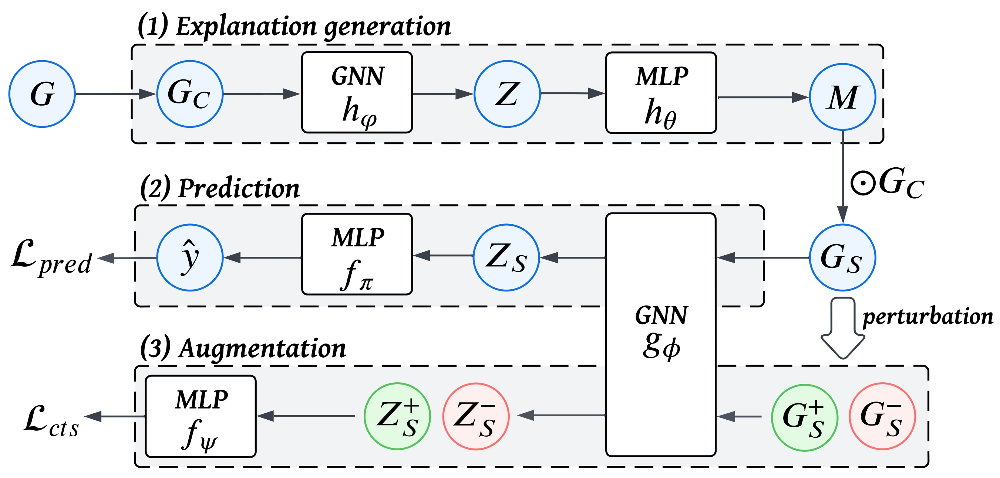

# SNEX-GNN 
Code implementation of AAAI 2024 paper "**Self-Interpretable Graph Learning with Sufficient and Necessary Explanations**". This work proposes a self-interpretable graph learning framework SNEX-GNN. Empowered by the contrastive learning, SNEX-GNN is able to generate both sufficient and necessary explanations that are beneficial  to the training of GNNs. The whole workflow of SNEX-GNN is presented as follows:



## Environment Setup

- Python 3.7
- torch~=1.10.1
- dgl~=1.1.0
- numpy~=1.21.5
- PyYAML, scikit_learn, tqdm

## Datasets

Datasets are provided in the `dataset` folder. Take Citeseer as example:

- `citeseer_graph.bin`: graph data;
- `citeseer_index.bin`: Training, validation, and test set split and label information;
- `citeseer_sg.bin`:The cached computation graph for each node, which will be automatically generated when running the code for the first time.

### Homogeneous Graph Data

The homogeneous graph datasets we utilize include Citeseer, Cora, Pubmed, Amazon-Photo, Coauthor-CS, and Coauthor-Physics. These datasets are part of the standard dataset collection available in the [dgl](https://docs.dgl.ai/en/1.0.x/api/python/dgl.data.html#node-prediction-datasets) documentation. 

Run our code and it will automatically download these datasets and their training and testing splits from dgl.

Note that for Amazon-Photo, Coauthor-CS, and Coauthor-Physics, there is no standard split of training and testing set by dgl, we provide our split in as `{dataset_name}_index_pre.bin`. 

### Heterogeneous Graph Data

The heterogeneous graph datasets we utilize include [DBLP](https://github.com/BUPT-GAMMA/HeCo/tree/main/data/dblp), [ACM](https://github.com/BUPT-GAMMA/HeCo/tree/main/data/acm) and [IMDB](https://www.kaggle.com/carolzhangdc/imdb-5000-movie-dataset). Their graph data and splits are provided in `dataset.zip`.

## Running the Code

```shell
python main.py --method snexgnn --encoder gat --dataset citeseer --gpu 0 --num_seeds 5
```

- method: snexgnn, snexhgn, gat, gcn, simplehgn;
- encoder: gat, gcn, simplehgn;
- datasets: citeseer, cora, pubmed, amazon-photo, coauthor-physics, coauthor-cs, imdb, dblp, acm;

Detailed training scripts can be found in `train_baseline.sh`.
